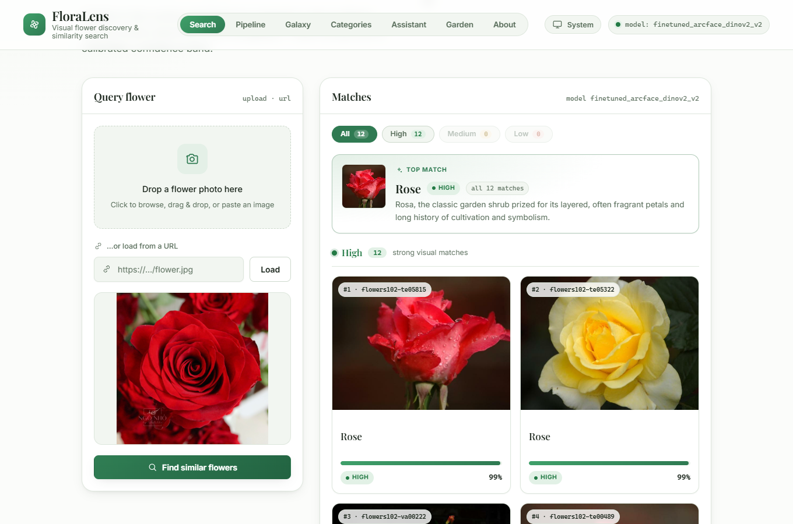
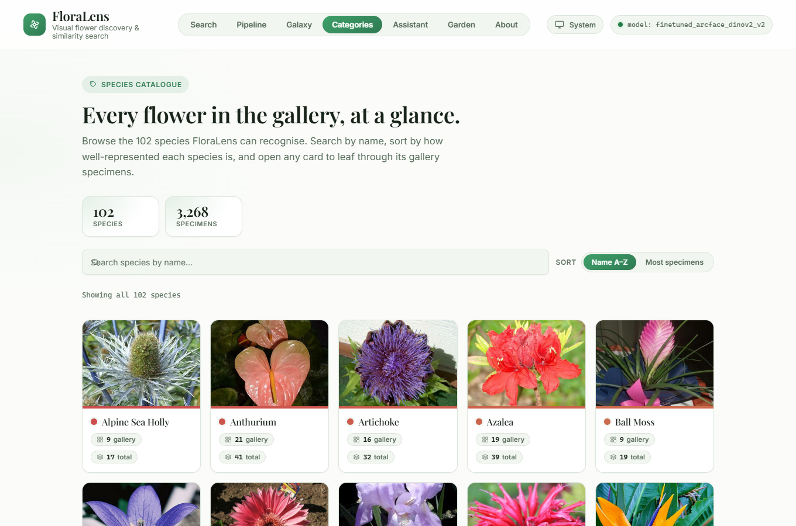
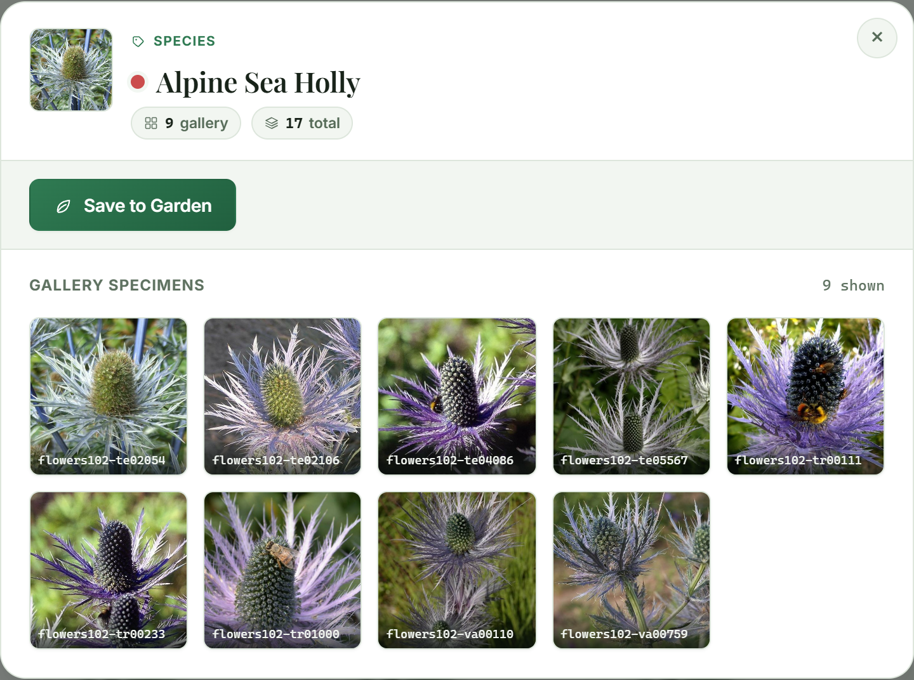
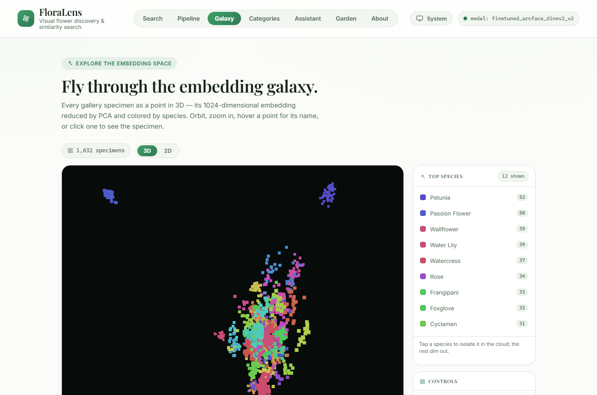
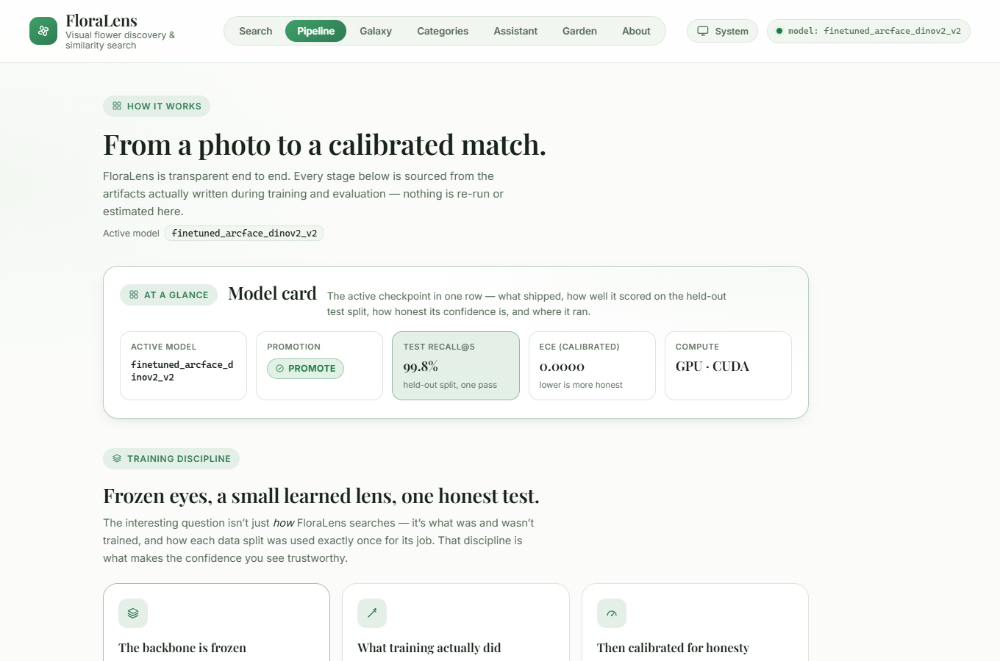
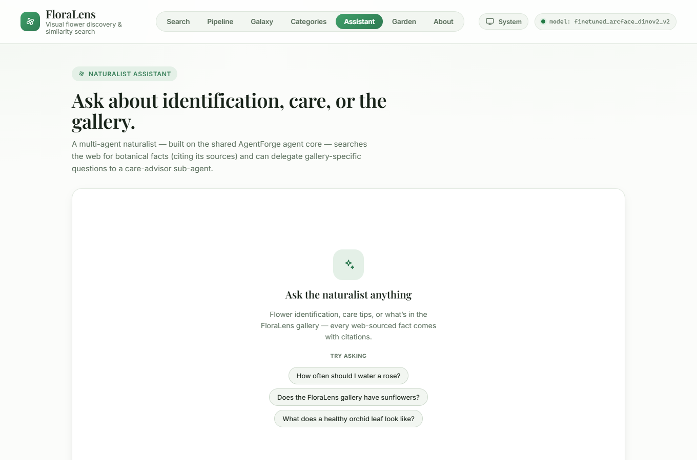
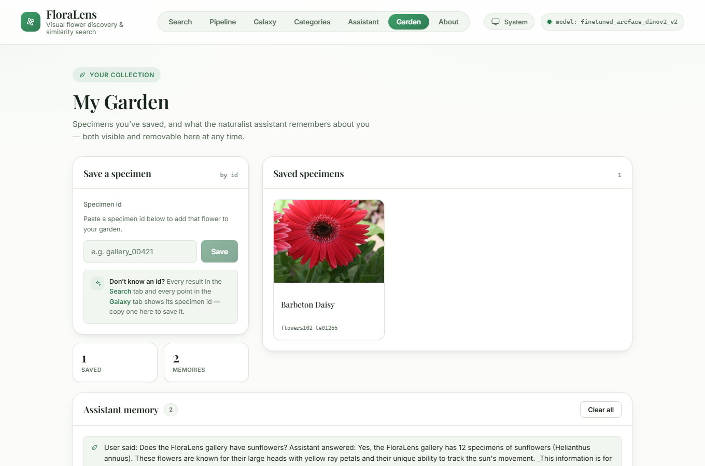

# FloraLens

**Visual flower identification and plant discovery platform powered by fine-tuned embedding models and multi-agent AI.**

Paste or upload a photo of any flower, instantly get visually similar species ranked by calibrated confidence scores, explore them in an interactive 3D galaxy, and chat with an AI naturalist assistant that remembers your personal plant collection.


*Visual search: rose photo → ranked species matches with calibrated confidence scores and high/medium/low bands.*

---

## Capabilities

### Visual Similarity Search
Upload or paste a flower image to find visually similar species. Results are ranked by **calibrated confidence scores** (not raw cosine similarity), with each match labeled as high/medium/low confidence. Powered by a fine-tuned embedding model (DINOv2 ViT-L/14 with ArcFace projection head) achieving **97.6% Recall@1** on held-out test set.


*Species Catalogue: Browse all 102 flower classes, each with gallery specimen count and a representative thumbnail.*

### Species Catalogue
Browse the full 102-flower species taxonomy at a glance. Each species shows its gallery count, total dataset count, and a representative specimen thumbnail. Color-coded for visual consistency with the 3D galaxy.


*Species Details: View all gallery specimens for a species and save your favorites to "My Garden."*

### 3D Embedding Galaxy
Explore the learned embedding space as an interactive 3D point cloud. Each point represents a flower specimen; hover for details, click to inspect. The galaxy is color-coded by species family and navigable with your mouse — a visual proof that the model clusters similar flowers nearby.


*3D Galaxy: fly through 1,632 gallery specimens in learned embedding space, colored by species.*

### ML Pipeline Transparency
The Pipeline page shows the full machine-learning architecture: dataset composition (train/val/test splits), preprocessing steps, the frozen DINOv2 backbone, the ArcFace head training, calibration results (ECE → 0.00005), and the promotion gate decision that activates new models. No black box.


*Pipeline Snapshot: dataset scale, preprocessing flow, backbone details, val/test metrics side by side, and calibration.**

### Naturalist AI Assistant
Chat with a multi-agent team: the Supervisor routes your query to the Identifier (visual search), Researcher (web search), and Care Advisor. Answers are streamed with full tool-call transparency, citations, and a disclaimer. The assistant remembers your garden preferences and past plants across sessions.


*Naturalist Assistant: multi-agent chat with streaming responses, tool traces, and memory-augmented answers.*

### My Garden
Save identified plants to your personal collection. The assistant augments its answers with knowledge of your saved plants and their locations, making advice context-aware and personalized.


*My Garden: persistent collection of plants you've identified, with assistant-memory integration.*

---

## Quick Start

### Prerequisites
- Python 3.11+ (for the API backend)
- Node.js 18+ (for the web frontend)
- NVIDIA GPU (optional; CPU fallback available)
- `OPENAI_API_KEY` and `TAVILY_API_KEY` (for the naturalist assistant)

### 1. Start the FastAPI Backend

```bash
cd apps/api
python -m venv venv

# On Windows:
venv\Scripts\python.exe -m pip install -r requirements.txt
venv\Scripts\python.exe -m uvicorn apps.api.app.main:app --port 8100

# On macOS/Linux:
python -m pip install -r requirements.txt
python -m uvicorn apps.api.app.main:app --port 8100
```

The API auto-loads `.env` files from the project root and the sibling `agentforge/` directory, so set `OPENAI_API_KEY` and `TAVILY_API_KEY` there or in your shell environment.

**Health check:** `curl http://localhost:8100/api/health`

### 2. Start the Next.js Web Frontend

```bash
cd apps/web
npm install
npm run dev
```

Open your browser to `http://localhost:3100` and start searching for flowers.

### 3. (Optional) Run the ML Pipeline

The API ships with pre-built embeddings and a fine-tuned model. To rebuild the gallery index from scratch:

```bash
cd .
python -m venv venv

# Install ML dependencies (includes torch + DINOv2):
venv\Scripts\python.exe -m pip install -r requirements.txt  # or apps/api/requirements.txt
venv\Scripts\python.exe -m pip install torch==2.7.1+cu126 torchvision==0.22.1+cu126 \
  --index-url https://download.pytorch.org/whl/cu126
venv\Scripts\python.exe -m pip install open-clip-torch==2.31.0

# Build the splits and embeddings:
venv\Scripts\python.exe -m ml.scripts.build_splits
venv\Scripts\python.exe -m ml.scripts.build_embeddings_index
venv\Scripts\python.exe -m ml.scripts.run_baseline_eval
```

See [ml/README in the source README](README.md#run-the-api) for the full pipeline (includes fine-tuning, test eval, calibration, and promotion gate).

---

## Architecture

**Frontend (Next.js + React + Three.js)** on port 3100 communicates with a **Python FastAPI backend** on port 8100. The backend orchestrates three core subsystems:

- **ML/Embedding Service:** fine-tuned DINOv2 backbone with ArcFace projection head; in-memory cosine vector store; calibrated retrieval scores.
- **Unified Agent Core:** multi-agent LangGraph runtime (supervisor, identifier, researcher, care-advisor); web search integration; per-user memory via mem0.
- **Persistence:** SQLite for garden plants and assistant memory; embeddings cache (NumPy) + metadata; model artifacts (PyTorch weights + calibrator).

See [docs/architecture.md](docs/architecture.md) for the full system diagram, data flows, and service module breakdown.

---

## Documentation

- **[Architecture](docs/architecture.md)** — System design, data flow, service modules, and component interaction diagram.
- **[API Reference](docs/api.md)** — Complete endpoint reference (request/response schemas, status codes, examples).
- **[Machine Learning](docs/ml.md)** — Dataset, preprocessing, DINOv2 backbone, ArcFace training, calibration, metrics, and model evaluation protocol.
- **[Unified Agent Core Reuse](docs/cross-product-reuse.md)** — How FloraLens proves the shared agent core is domain-independent.

---

## Key Files & Setup

| Path | Purpose |
|---|---|
| `apps/api/` | FastAPI backend; see `app/main.py` for route definitions. |
| `apps/web/` | Next.js + React frontend; see `app/` for page components. |
| `ml/` | ML training, evaluation, calibration, and index building. |
| `PRD.md` | Full product requirements (user stories, success metrics, non-goals). |
| `IMPLEMENTATION-PLAN.md` | Phased roadmap and exit criteria per phase. |

---

## Technologies

| Component | Stack |
|---|---|
| **Frontend** | Next.js (App Router), React, TypeScript, Three.js (react-three-fiber), Tailwind CSS |
| **Backend** | Python 3.11, FastAPI, Pydantic, SQLite |
| **ML** | PyTorch, OpenCLIP/DINOv2, scikit-learn (calibration, metrics), UMAP |
| **Agents** | LangGraph, Unified Agent Core (editable install), mem0 (long-term memory) |
| **Observability** | MLflow (experiment tracking), structured logging, tool-call traces |

---

## Environment Variables

| Variable | Purpose | Example |
|---|---|---|
| `OPENAI_API_KEY` | OpenAI API key for the naturalist assistant | (set from `.env` or shell) |
| `TAVILY_API_KEY` | Tavily web search API key for the researcher agent | (set from `.env` or shell) |
| `FLORALENS_DEVICE` | GPU/CPU device selection (`auto`, `cuda`, or `cpu`) | `auto` (default) |
| `MODEL_VERSION` | Active embedding model (`finetuned_arcface_dinov2_v2` or `baseline`) | `finetuned_arcface_dinov2_v2` (default) |
| `FLORALENS_API_KEY` | (Optional) API key for write endpoints (garden, assistant, memory) | unset (optional hardening) |

---

## Project Status

**Phase 3b (Test Eval + Calibration + Promotion Gate) ✅ COMPLETE**

- ✅ 102-class Oxford Flowers dataset with leakage-free splits
- ✅ Zero-shot DINOv2 baseline (Recall@1 = 95.35%)
- ✅ ArcFace fine-tuned model (Recall@1 = 97.62%)
- ✅ Score calibration (ECE 0.499 → 0.00005)
- ✅ Confidence bands (high/medium/low) in search results
- ✅ Interactive 3D species visualization
- ✅ Naturalist multi-agent assistant (reusing AgentForge core)
- ✅ My Garden + persistent memory
- ✅ ML regression tests + leakage guards
- ⏳ Full end-to-end CI/CD pipeline (in progress)

---

## License & Attribution

- **Dataset:** Oxford 102 Flowers (public domain; hosted on Hugging Face Hub for reliability)
- **Vision Backbone:** DINOv2 (Meta AI Research; Apache 2.0)
- **Embedding Model:** Fine-tuned with ArcFace loss (Deng et al., CVPR 2019)
- **Agent Core:** Unified Agent Core (shared with AgentForge; see `packages/agent-core`)

---

## Questions?

See the [Documentation](#documentation) section, check `PRD.md` for product decisions, or inspect `IMPLEMENTATION-PLAN.md` for phase status and next steps.
